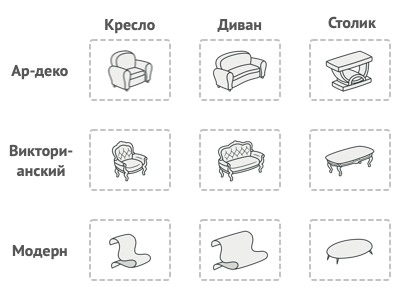

## Абстрактная фабрика
На основе [этой статьи](https://refactoring.guru/ru/design-patterns/abstract-factory)

Абстрактная фабрика является одним из вариантов развития паттерна
[фабричный метод](./factory_method.md).

**Проблема:** Необходимо реализовать различные семейства классов, связанных между
собой схожими интерфейсами, (например элементы GUI для различных систем). При этом
определить, какое именно "семейство" классов хотелось где-нибудь в одном месте, и
в дальнейшем все создаваемые элементы были бы одного "семейства".

**Пример**: Необходимо реализовать фабрику, выпускающую мебель в разных стилях.
При этом при заказе новой мебели, она должна сочетаться с той, что мы уже выпустили.

При этом при добавлении нового стиля/типа мебели, хотелось бы расширять код, а не
изменять его.

**Решение**: Заметим, что вне зависимости от стиля, на всех креслах можно сидеть,
на всех диванах лежать, а на все столы можно что-то положить. Таким образом для 
каждого типа мебели существует реализуемый им интерфейс. Выделим абстрактные классы
`Кресло`, `Диван`, `Стол`, которые будут содержать в себе интерфейс взаимодействия
с конкретными классами мебели. Реализация интерфейса будет происходить в дочерних
классах: `ВикторианскоеКресло`, `МодернКресло` и т.д.

Для каждого стиля мебели создадим отдельные фабрики, которые будут выпускать только
мебель своего стиля и реализовывать интерфейсы родительского класса - _абстрактной
фабрики_. Она, в свою очередь, будет выпускать "абстрактную" мебель.

**[Пример реализации](../../src/patterns/abstract_factory.cpp)**

| Плюсы | Минусы |
|-------|--------|
| Гарантирует сочетаемость |  Усложняет код из за введения кучи классов |
| Реализует принцип _открытости/закрытости_ | Требует наличие всех продуктов каждого типа |
| Упрощает добавление новых продуктов |  |

**Отношение к другим паттернам:** 
* является эволюцией паттерна [фабричный метод](../factory_method.md).
