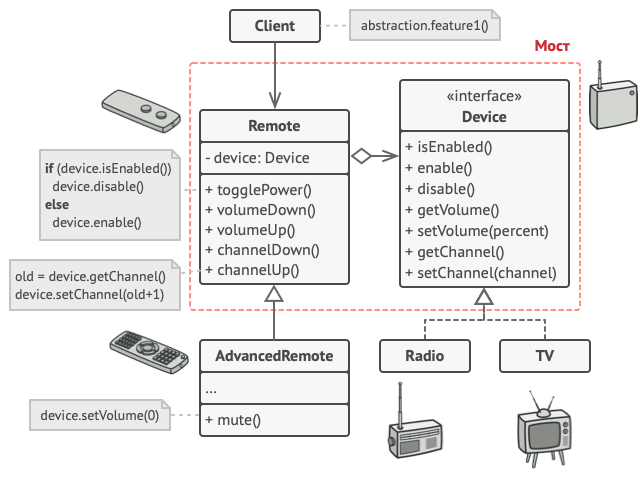

## Мост
На основе [этой статьи](https://refactoring.guru/ru/design-patterns/bridge)

Паттерн спроектирован для разделения абстракции (интерфейса) и его реализации (не 
путать с абстрактным классом), для того, чтобы их можно было редактировать
независимо.

**Пример:** У нас есть пользовательский интерфейс для работы с какими-то системными
штуками. И есть сложный движок для взаимодействия с этой системой, со сложной бизнес
логикой. Причем на разных системах взаимодействие с этой системой реализовано
по-разному. Если держать всё в одном классе, то он будет монструозно огромен.

**Решение:** В таком случае мы можем разделить наш класс на `интерфейс` (наш GUI) и
различные реализации, связав их мостом:

В коде это будет выглядеть примерно следующим образом:

**[Пример реализации](../../src/patterns/bridge.cpp)**

**Отношение к другим паттернам:** будет написано после освоения этих самих паттернов