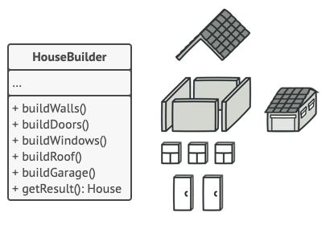

## Строитель (Builder)
На основе [этой статьи](https://refactoring.guru/ru/design-patterns/builder)
 
Строитель является одним из вариантов развития паттерна
[фабричный метод](./factory_method.md). Перед началом разбора _Строителя_ стоит
ознакомиться с этим паттерном.

**Проблема:** К проблемам, решаемым [фабричным методом](./factory_method.md)
добавляется также то, что создавать приходится сложные объекты с кучей параметров,
часть из которых не всегда необходима. Как вариант решения можно сделать для класса
тысячу и один конструктор, которые учтут все возможные варианты параметров. Либо ту
же тысячу фабричных методов, которые будут принимать в качестве аргументов различные
параметры. Либо один огромный конструктор/фабричный метод, часть аргументов которого
можно заменить на nullptr. Сложно, муторно, некрасиво.

**Пример:** Есть различные типы домов. У некоторых может быть гараж. У некоторых
бассейн. У некоторых сад или всё сразу и т.п.

И какая-нибудь страшилка для создания всего этого безобразия в различных его 
вариациях:

**Решение:** Вместо того, чтобы создавать сразу готовый дом, разделим его 
строительство на этапы, предоставив процесс создания дома отдельному классу - 
_Строителю_:

Просто и удобно. Через отдельные методы накидываем необходимые для нашего конкретного
дома элементы, а потом забираем у Строителя всё уже готовое.

Следующем этапом развития паттерна строитель является добавление в него класса
_Директора_. Но прежде чем решать проблему, нужно её сначала себе создать.

________________________________________________________________________________

**Проблема 2:** Имеются различные объекты со схожими этапами _строительства_. И нам
очень не хочется дублировать код создания этих объектов.

**Пример:** Есть у нас автомобиль и документация к нему (что входит в комплектацию
и как этим пользоваться). Для разных авто разная документация, но напрямую зависящая
от комплектации. То есть этапы создания этих объектов схожи (добавили в автомобиль
сиденье - добавили в документацию информацию о добавляемом сиденье). При этом классы
получаемых из строителя объектов совершенно разные и не имеют общего "предка" (не 
обязательно, но для усложнения примера пусть будет так).

**Решение:** Создадим два строителя с общим интерфейсом, описывающим этапы
строительства. Кроме этого создадим класс _Директора_, в котором будут содержаться
методы конструирования "типичных" объектов. Внимательный читатель может на этом
этапе заметить, что в начале мы избавлялись от сложных конструкторов/фабричных
методов, и теперь предлагаем снова их понадобавлять, да ещё и в отдельный класс.
Почти. Но, момент раз - здесь нет необходимости предоставлять все возможные варианты
того, что мы собираемся строить. Момент два - мы решаем немножко другую задачу,
у нас уже есть строители, есть схожие по строению объекты и необходимость не
дублировать лишний раз код. И пока мы окончательно не запутались, вот картинка:

**[Пример реализации](../../src/patterns/builder.cpp)**