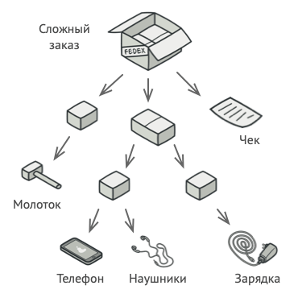
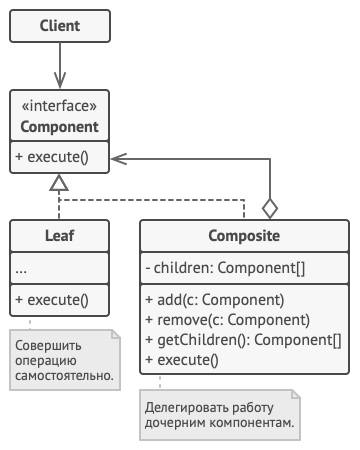

## Компоновщик
На основе [этой статьи](https://refactoring.guru/ru/design-patterns/composite)

Суть паттерна - представление иерархии объектов в виде дерева и работа с ними как с
одним объектом.

**Пример:** есть `Коробка`, в которой может лежать либо `Продукт`, либо другая
`Коробка`, внутри которой может лежать еще одна `Коробка` и так далее. И мы хотим
реализовать функцию подсчета стоимости всего, что лежит в коробке.

**Решение:** Отнаследнуем и `Коробку`, и `Продукт` от одного общего интерфейса -
вернуть цену. `Продукт` просто возвращает свою стоимость, а `Коробка` проходит по
всем вложенным объектам и возвращает сумму стоимости всех вложенных объектов.

В общем случае реализация паттерна выглядит следующим образом:

**[Пример реализации](../../src/patterns/composite.cpp)**

**Отношение к другим паттернам:** будет написано после освоения этих самих паттернов