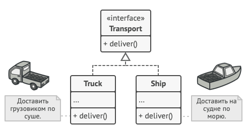

## Фабричный метод
На основе [этой статьи](https://refactoring.guru/ru/design-patterns/factory-method)

**Проблема:** есть сходные объекты с одной и той-же бизнес-логикой (и кол-во таких
различных типов объектов со временем может знатно расшириться), но разной реализацией
внутри (кнопки и окна для разных операционных систем). Вместо большого ветвления с 
кучей if-ов и прочих весёлостей можно воспользоваться классом с фабричным методом.

**Пример:** представьте, что вы создаёте программу управления грузовыми
перевозками. Сперва вы рассчитываете перевозить товары только на автомобилях.
Поэтому весь ваш код работает с объектами класса `Грузовик`.

В какой-то момент морские перевозчики просят добавить поддержку морской логистики
в программу. А вся программа заточена только под грузовики. При этом большая часть
кода для объектов класса `Корабль` и `Грузовик` будет общей. Но перелопатить придется
много. А если потом ещё и `Самолёт` добавлять придется...

**Решение:** Пусть основная часть бизнес-логики взаимодействия с `Транспортом`
(коим является и `Корабль` и `Грузовик`, т.е. они его дочерние классы) у нас
вынесена в отдельный класс `Логистика`. Вынесем получение объекта `Транспорт` в
отдельный _фабричный метод_. Это маленькое изменение позволяет нам
переопределить этот метод в дочерних от `Логистики` классах, оставив всю остальную
бизнес-логику неизменной.

При этом `Корабль` и `Грузовик` в свою очередь реализуют интерфейс `Транспорт` с
методом `доставить`, который в каждом из подклассов реализован по своему:

Таким образом использование данного паттерна позволяет расширять уже имеющийся код
без переписывания кодовой базы, реализуя принцип open/closed.

Кроме этого вынесение создания объекта в отдельный метод позволяет добавить
в создание объекта дополнительный функционал, например переиспользование уже
созданных объектов класса "продукта" вместо создания нового, что может быть полезно
при работе с "большими" объектами.

**[Пример реализации](../../src/patterns/factory_method.cpp)**

**Отношение к другим паттернам:** будет написано после освоения этих самих паттернов

